# 📚 Bookshelf API Technical Documentation

This documentation provides a detailed overview of the Bookshelf API built with Hapi.js. It covers architecture, code analysis, API reference, and data modeling to help developers understand, maintain, and extend the system.

---

## 1. **End-to-End Flowchart**

The following flowchart illustrates the full journey of a request from the client to the Hapi server, through routing, handlers, validation, data storage, and back to the client. It covers all CRUD operations and error handling for the Bookshelf API.


**Highlights:**

- Modular Request Flow: Every request is processed through a structured pipeline: Client → Server → Routes → Handler → Data Operations → Response.
- CRUD-Centric Architecture: The system follows a clear CRUD (Create, Read, Update, Delete) pattern with dedicated handlers for each operation.
- Centralized Data Storage: All data operations interact with a single books array that serves as the central data store.
- Validation-First Approach: Write operations (Create, Update) perform validation before executing any data modifications.
- Integrated Filtering Logic: GET operations with filtering are processed entirely within the handler layer, allowing complex business logic.
- Status-Code Based Responses: Each operation returns appropriate HTTP status codes (200, 201, 400, 404) indicating the result.
- Clear Separation of Concerns: The architecture separates routing logic, business logic, and data operations for better maintainability.
- Distinct Read vs Write Operations: GET operations focus on filtering/finding while POST/PUT/DELETE operations handle validation and data modification.
- Unified Data Access Point: All handlers access the same data structure (books array), ensuring data consistency across operations.
- End-to-End Request Processing: Every request undergoes complete processing from input to output with error handling at each stage.


---

## 2. **System Architecture Diagram**

This diagram shows the high-level architecture and relationships between the components of the Bookshelf API.

```mermaid
flowchart TB
    Client["HTTP Client<br>Browser / Postman / curl"]
    
    subgraph "Transport Layer"
        Server["Hapi.js Server<br>Port: 5000<br>CORS: Enabled"]
    end
    
    subgraph "API Layer"
        Routes["Route Definitions<br>5 RESTful Endpoints"]
        
        subgraph "Handler Layer"
            Validator["Input Validator<br>• Name required<br>• readPage ≤ pageCount"]
            Filter["Query Filter<br>• Name search<br>• Reading status<br>• Finished status"]
            CRUD["CRUD Operations<br>• Create<br>• Read<br>• Update<br>• Delete"]
        end
    end
    
    subgraph "Data Layer"
        Storage["In-Memory Storage<br>Array of Book Objects"]
        Metadata["Auto-generated<br>• ID (nanoid)<br>• Timestamps<br>• Finished status"]
    end
    
    subgraph "Response Layer"
        Formatter["Response Formatter<br>• Success formats<br>• Error formats"]
    end
    
    Client --> Server
    Server --> Routes
    
    Routes --> Validator
    Validator --> Filter
    Filter --> CRUD
    
    CRUD --> Storage
    Storage --> Metadata
    Storage --> Formatter
    
    Formatter --> Server
    Server --> Client
```



**Component Explanation:**
- **Client**: The entry point for API interaction, which can be a web browser, Postman, or cURL command-line tool, initiating HTTP requests to the server.
- **Transport Layer (Hapi.js Server)**: Manages network communication on port 5000, handles CORS policies to allow cross-origin requests, and serves as the gateway for all incoming HTTP traffic.
- **API Layer (Route Definitions)**: Defines the RESTful endpoints (5 routes) that map HTTP methods and URLs to specific handler functions, acting as the routing table for request distribution.
- **Handler Layer**: The core business logic layer containing three specialized components:
    - **Input Validator**: Enforces data integrity by validating required fields (name) and business rules (readPage ≤ pageCount).
    - **Query Filter**: Processes GET request parameters to filter books by name (case-insensitive search), reading status, and completion status.
    - **CRUD Operations**: Executes the fundamental database operations (Create, Read, Update, Delete) on book data.
- **Data Layer**: The persistent storage mechanism consisting of:
    - **In-Memory Storage**: A JavaScript array that temporarily holds all book objects while the server is running (volatile storage).
    - **Metadata Generator**: Automatically creates system-generated fields including unique IDs (nanoid), timestamps, and calculated completion status.
- **Response Layer (Formatter)**: Structures all API outputs into consistent JSON formats with appropriate status codes, success messages, and error responses before returning to the client.
- **End-to-End Flow**: Represents the complete request lifecycle where data flows from client through server layers, undergoes processing and storage operations, and returns formatted responses back to the client.


---

## 3. **File-by-File Code Analysis & Documentation**

### **File: handler.js**

This file contains all handler functions for the Bookshelf API, managing business logic, validation, and error handling for all endpoints.

#### **Function Signatures & Descriptions**

| Function Name            | Signature                                                                                                     | Description                          |
|------------------------- |--------------------------------------------------------------------------------------------------------------|--------------------------------------|
| addBookHandler           | `(request, h) => { ... }`                                                                                    | Adds a new book                      |
| getAllBooksHandler       | `(request, h) => { ... }`                                                                                    | Retrieves all books, supports filter |
| getBookByIdHandler       | `(request, h) => { ... }`                                                                                    | Retrieves a book by its ID           |
| editBookByIdHandler      | `(request, h) => { ... }`                                                                                    | Updates book data by ID              |
| deleteBookByIdHandler    | `(request, h) => { ... }`                                                                                    | Deletes book by ID                   |

#### **Business Logic & Validation**

- **addBookHandler**
  - Ensures the `name` field is provided; if missing, responds with 400.
  - Checks that `readPage` is not greater than `pageCount`; if invalid, responds with 400.
  - Creates a new book object with a unique id and timestamps.
  - `finished` is computed as `pageCount === readPage`.
  - Pushes the new book into the books array.
  - Confirms successful insert using a filter check; responds with 201 on success, 500 on failure.

- **getAllBooksHandler**
  - Supports filtering by `name`, `reading`, and `finished` via query parameters.
  - Returns only `id`, `name`, and `publisher` fields in the response.
  - If no books or no filters provided, returns all books.
  - Filters are case-insensitive for `name` and use loose equality (`==`) for boolean query params.

- **getBookByIdHandler**
  - Retrieves a book by its unique `id`.
  - Responds with 404 if the book is not found.

- **editBookByIdHandler**
  - Finds the book by `id`.
  - Validates that `name` is provided and that `readPage` ≤ `pageCount`.
  - Updates the book object with new data and an updated timestamp.
  - Responds with 200 on success, 400/404 on validation/id errors.

- **deleteBookByIdHandler**
  - Deletes a book by `id` if it exists.
  - Responds with 200 on success, 404 if the book is not found.

#### **Validation Logic**

- **Mandatory Fields:** `name` must be present for both create and update.
- **Page Validation:** `readPage` cannot be greater than `pageCount` for both create and update.
- **Query Filters:** Supports `name` (substring match), `reading` (0 or 1), `finished` (0 or 1).
  - Potential bug: Uses loose equality (`==`). This could cause unintended truthy matches (e.g., `"0" == 0` is true).

#### **Response Formats**

- **Success:**
  - `status: 'success'`
  - `data`: Varies per endpoint (may include book object or list)
- **Failure:**
  - `status: 'fail'`
  - `message`: Describes the error (e.g., "Buku tidak ditemukan")

**Potential Issues:**
- Uses `==` for comparison of query params and booleans, which can be ambiguous.
- Books are stored in-memory; data is lost on server restart.
- No type-checking for input data (e.g., year, pageCount).

---

### **File: routes.js**

This file defines the routing table for the API, mapping HTTP methods and paths to handler functions.

#### **Endpoints Table**

| Method | Path           | Handler                | Path Params | Query Params        | Description                   |
|--------|----------------|------------------------|-------------|---------------------|-------------------------------|
| POST   | /books         | addBookHandler         | None        | None                | Create a new book             |
| GET    | /books         | getAllBooksHandler     | None        | name, reading, finished | Retrieve list of books (can filter) |
| GET    | /books/{id}    | getBookByIdHandler     | id          | None                | Retrieve a book by ID         |
| PUT    | /books/{id}    | editBookByIdHandler    | id          | None                | Update book by ID             |
| DELETE | /books/{id}    | deleteBookByIdHandler  | id          | None                | Delete book by ID             |

#### **URL Parameters**

- `{id}`: String, unique identifier for a specific book (used in GET, PUT, DELETE).

---

### **File: server.js**

This file is responsible for initializing and starting the Hapi server.

#### **Server Configuration**

- **Port:** `5000`
- **Host:** `localhost`
- **CORS:** Enabled for all origins (`origin: ['*']`), allowing cross-origin API requests.

#### **Server Initialization**

- Imports Hapi and the routes array.
- Creates a new Hapi server instance.
- Registers all routes from `routes.js`.
- Starts the server and logs the server URI.

#### **Route Registration**

All endpoints defined in `routes.js` are registered to the Hapi server instance.

---

### **File: books.js**

This file serves as the in-memory data layer for the Bookshelf API.

#### **Data Structure**

- **Type:** JavaScript Array
- **Contents:** Book objects as per the data model
- **Persistence:** Volatile; all data will be lost when the server restarts.

#### **Usage**

All CRUD operations directly manipulate this array.

---

## 4. **API Reference (Swagger Style)**

### **POST /books** - Create Book

#### **Create Book (POST /books)**

```api
{
    "title": "Add Book",
    "description": "Create a new book and add it to the collection.",
    "method": "POST",
    "baseUrl": "http://localhost:5000",
    "endpoint": "/books",
    "headers": [
        {
            "key": "Content-Type",
            "value": "application/json",
            "required": true
        }
    ],
    "bodyType": "json",
    "requestBody": "{\n  \"name\": \"Atomic Habits\",\n  \"year\": 2018,\n  \"author\": \"James Clear\",\n  \"summary\": \"Summary of the book.\",\n  \"publisher\": \"Random Publisher\",\n  \"pageCount\": 320,\n  \"readPage\": 100,\n  \"reading\": true\n}",
    "responses": {
        "201": {
            "description": "Book created successfully",
            "body": "{\n  \"status\": \"success\",\n  \"message\": \"Buku berhasil ditambahkan\",\n  \"data\": {\n    \"bookId\": \"random_generated_id\"\n  }\n}"
        },
        "400": {
            "description": "Validation error (missing name or readPage > pageCount)",
            "body": "{\n  \"status\": \"fail\",\n  \"message\": \"Gagal menambahkan buku. Mohon isi nama buku\"\n}"
        },
        "500": {
            "description": "Server error (could not add book)",
            "body": "{\n  \"status\": \"fail\",\n  \"message\": \"Buku gagal ditambahkan\"\n}"
        }
    }
}
```

---

### **GET /books** - Get All Books (with Filtering)

#### **Get All Books (GET /books)**

```api
{
    "title": "Get All Books",
    "description": "Retrieve all books with optional filtering by name, reading, or finished.",
    "method": "GET",
    "baseUrl": "http://localhost:5000",
    "endpoint": "/books",
    "headers": [],
    "queryParams": [
        {
            "key": "name",
            "value": "Substring match for book name",
            "required": false
        },
        {
            "key": "reading",
            "value": "Filter by reading status (0 or 1)",
            "required": false
        },
        {
            "key": "finished",
            "value": "Filter by finished status (0 or 1)",
            "required": false
        }
    ],
    "bodyType": "none",
    "requestBody": "",
    "responses": {
        "200": {
            "description": "List of books matching filter",
            "body": "{\n  \"status\": \"success\",\n  \"data\": {\n    \"books\": [\n      { \"id\": \"string\", \"name\": \"Atomic Habits\", \"publisher\": \"Random Publisher\" }\n    ]\n  }\n}"
        }
    }
}
```

---

### **GET /books/{id}** - Get Book by ID

#### **Get Book by ID (GET /books/{id})**

```api
{
    "title": "Get Book by ID",
    "description": "Retrieve detailed information for a specific book by ID.",
    "method": "GET",
    "baseUrl": "http://localhost:5000",
    "endpoint": "/books/{id}",
    "headers": [],
    "pathParams": [
        {
            "key": "id",
            "value": "Book ID",
            "required": true
        }
    ],
    "bodyType": "none",
    "requestBody": "",
    "responses": {
        "200": {
            "description": "Book found",
            "body": "{\n  \"status\": \"success\",\n  \"data\": {\n    \"book\": { \"id\": \"string\", \"name\": \"Atomic Habits\", \"year\": 2018, \"author\": \"James Clear\", \"summary\": \"Summary\", \"publisher\": \"Random Publisher\", \"pageCount\": 320, \"readPage\": 100, \"finished\": false, \"reading\": true, \"insertedAt\": \"2024-06-10T10:00:00Z\", \"updatedAt\": \"2024-06-10T10:00:00Z\" }\n  }\n}"
        },
        "404": {
            "description": "Book not found",
            "body": "{\n  \"status\": \"fail\",\n  \"message\": \"Buku tidak ditemukan\"\n}"
        }
    }
}
```

---

### **PUT /books/{id}** - Update Book

#### **Update Book (PUT /books/{id})**

```api
{
    "title": "Update Book by ID",
    "description": "Update an existing book's information.",
    "method": "PUT",
    "baseUrl": "http://localhost:5000",
    "endpoint": "/books/{id}",
    "headers": [
        {
            "key": "Content-Type",
            "value": "application/json",
            "required": true
        }
    ],
    "pathParams": [
        {
            "key": "id",
            "value": "Book ID",
            "required": true
        }
    ],
    "bodyType": "json",
    "requestBody": "{\n  \"name\": \"New Title\",\n  \"year\": 2020,\n  \"author\": \"Another Author\",\n  \"summary\": \"New summary\",\n  \"publisher\": \"New Publisher\",\n  \"pageCount\": 200,\n  \"readPage\": 200,\n  \"reading\": true\n}",
    "responses": {
        "200": {
            "description": "Book updated successfully",
            "body": "{\n  \"status\": \"success\",\n  \"message\": \"Buku berhasil diperbarui\"\n}"
        },
        "400": {
            "description": "Validation error",
            "body": "{\n  \"status\": \"fail\",\n  \"message\": \"Gagal memperbarui buku. Mohon isi nama buku\"\n}"
        },
        "404": {
            "description": "Book ID not found",
            "body": "{\n  \"status\": \"fail\",\n  \"message\": \"Gagal memperbarui buku. Id tidak ditemukan\"\n}"
        }
    }
}
```

---

### **DELETE /books/{id}** - Delete Book

#### **Delete Book (DELETE /books/{id})**

```api
{
    "title": "Delete Book by ID",
    "description": "Delete a book from the collection by ID.",
    "method": "DELETE",
    "baseUrl": "http://localhost:5000",
    "endpoint": "/books/{id}",
    "headers": [],
    "pathParams": [
        {
            "key": "id",
            "value": "Book ID",
            "required": true
        }
    ],
    "bodyType": "none",
    "requestBody": "",
    "responses": {
        "200": {
            "description": "Book deleted successfully",
            "body": "{\n  \"status\": \"success\",\n  \"message\": \"Buku berhasil dihapus\"\n}"
        },
        "404": {
            "description": "Book ID not found",
            "body": "{\n  \"status\": \"fail\",\n  \"message\": \"Buku gagal dihapus. Id tidak ditemukan\"\n}"
        }
    }
}
```

---

## 5. **Data Model & Structure**

The Book object is defined as follows:

```javascript
{
  id: string,                // Unique identifier, generated by nanoid
  name: string,              // Book title (required)
  year: number,              // Year of publication
  author: string,            // Author name
  summary: string,           // Book summary
  publisher: string,         // Publisher name
  pageCount: number,         // Total number of pages
  readPage: number,          // Pages read so far
  finished: boolean,         // true if pageCount === readPage
  reading: boolean,          // Whether currently being read
  insertedAt: string,        // ISO timestamp when created
  updatedAt: string          // ISO timestamp when last updated
}
```

---

```card
{
  "title": "In-memory Storage Warning",
  "content": "All book data is stored in memory and will be lost when the server restarts. Use persistent storage for production."
}
```

---

# 🎉 That's all!  
This documentation should provide a comprehensive reference for the Bookshelf API for both development and maintenance purposes.
